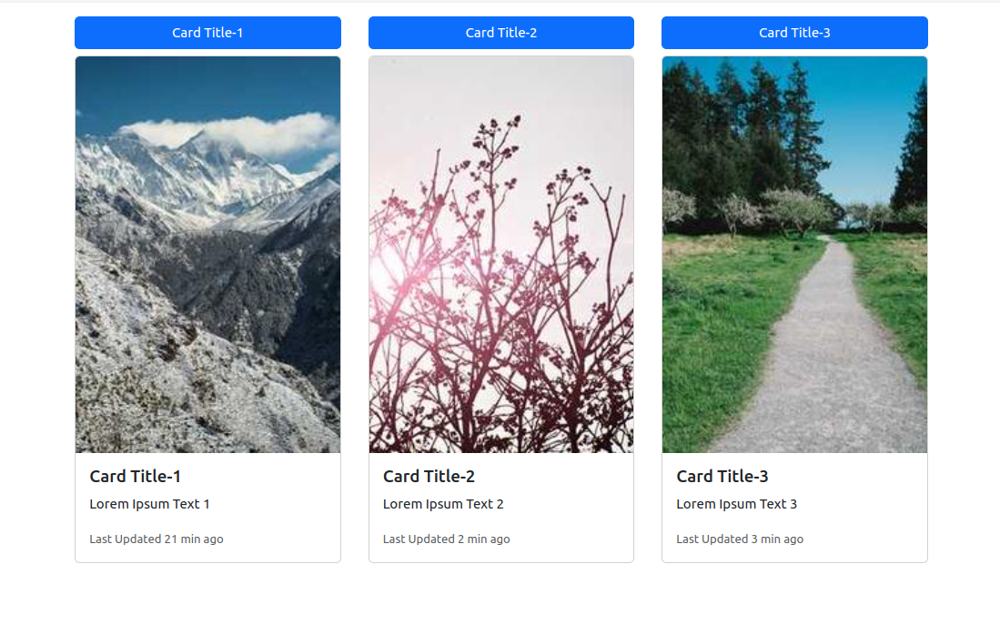
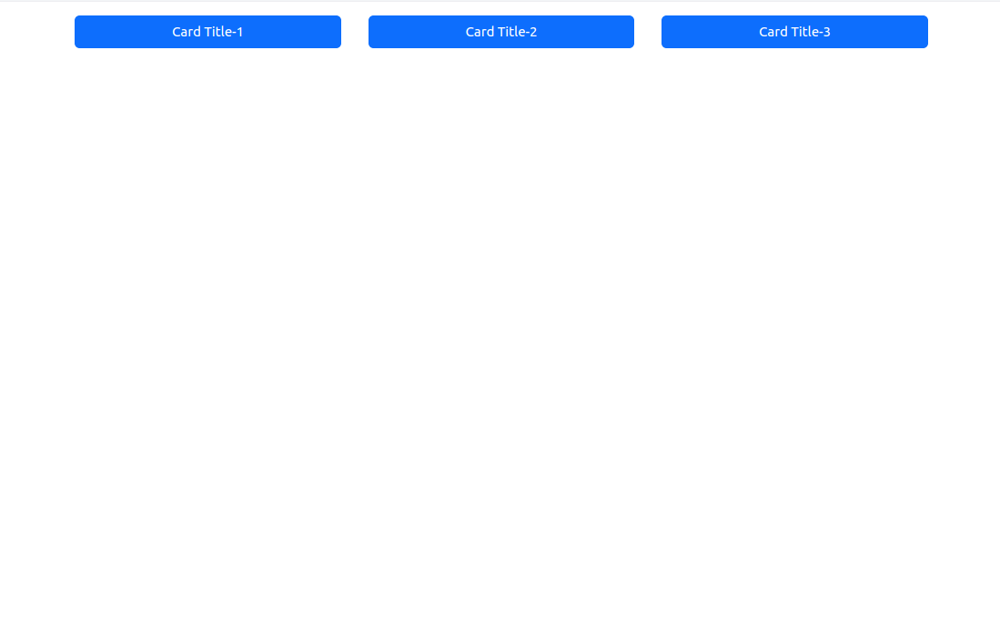
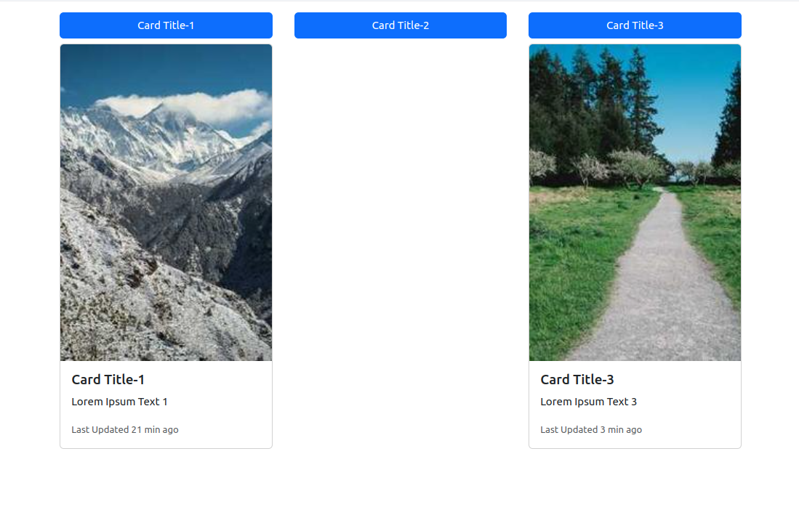

# Simple React Card App

This is a simple project created with React to demonstrate and learn the following concepts:

- **What is a Component:** Understanding the building blocks of a React application.
- **Component Lifecycle:** Learning the different phases of a component's lifecycle.
- **JSX Structure:** Using JSX syntax to write HTML within JavaScript.
- **Child Components:** Creating and managing child components within a parent component.
- **State and Props:** Understanding state and props, their differences, and how they are used to manage data and pass information between components.
- **Function vs. Class Components:** Exploring the differences between function components and class components, and when to use each.

Each of these concepts is applied and illustrated within this project.

### Images

### Running the Application

Runs the app in the development mode.\
After cloning the application, navigate to the `my-app` directory with the command `cd my-app`, then run the command `npm start`. Open [http://localhost:3000](http://localhost:3000) to view it in your browser.

The page will reload when you make changes. You may also see any lint errors in the console.
